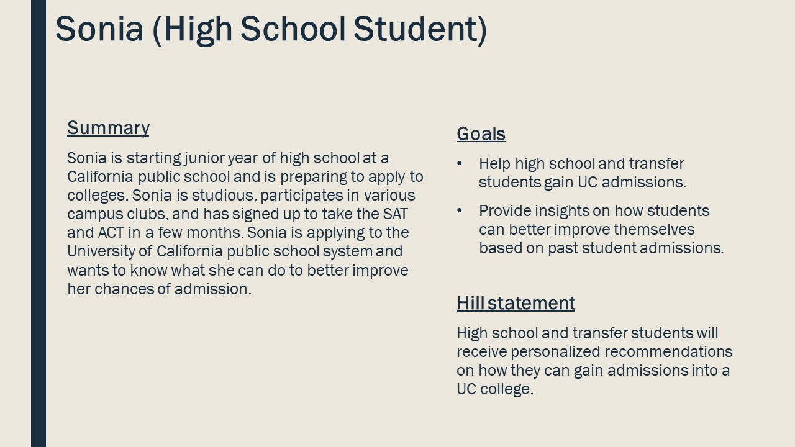
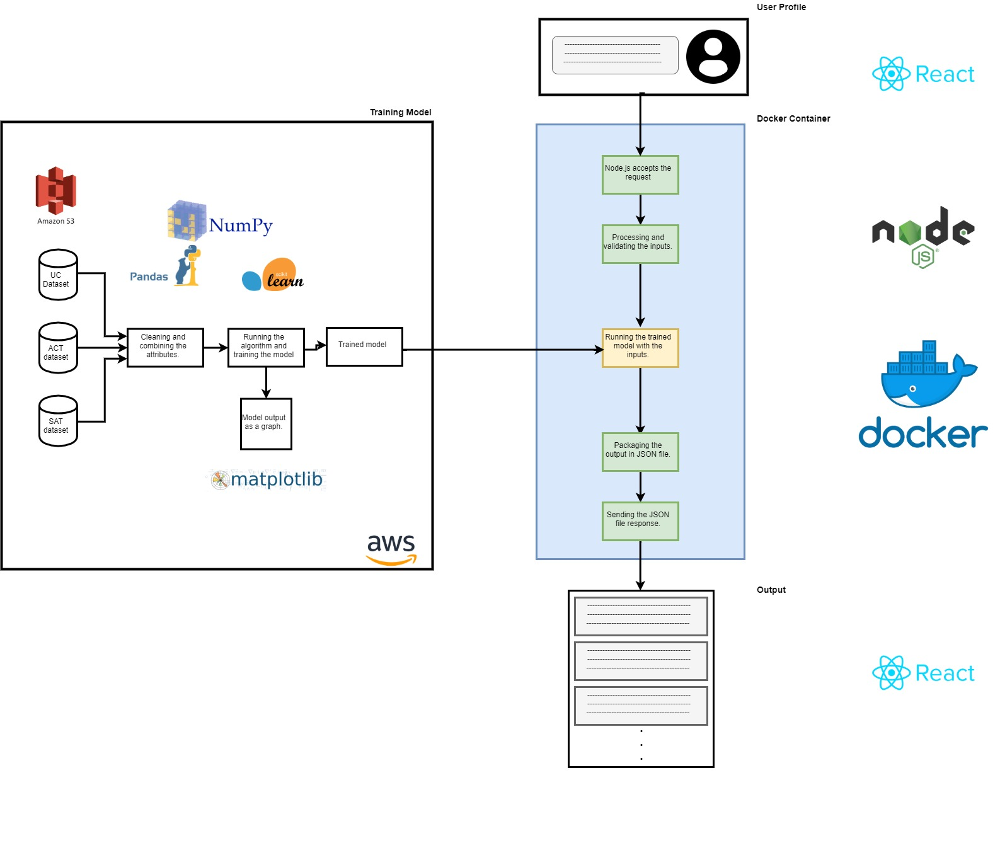

# ProjectGroup-25


### Team Members
Sonia Mannan  
Tej Jaikumar Chaugule  
Vasanthi Amoolya Koduri  
Kunj Parikh  


## GoSAT - APPROVED (read below)
SAT or ACT alone does not decide scholorship and there are limited colleges who provide SAT based scholorships. so bring more diverse data but idea is good ... you need to provide actionable insights and prescriptive analytics. 

### Description:

The University of California college system provides execptional and affordable education for students. UC admissions are often highly-sought after by highschool and transfer students - over 200,000 students applied for UC admissions in 2018. We propose to provide a tool for students to inform them on whether or not they are on-track to get into a UC. 

Students will provide data about themselves such as their type of school (private, public, community, college), location, school name, gender, ethnicity, grade, GPA, SAT, and ACT. Using these factors our application will tell them how likely they are to be admitted into a UC, using admissions data from 1994 to 2018. Students can use the application to track their academic progress and make sure they are still on-track to be admitted.

Our application will train a logistic regression algorithm from aggregated SAT/ACT data sources with UC admissions data to determine student probability of admission.

A stretch goal would be to then find relevant scholarships for the student's profile, specifically to help them pay for a UC education. Using the above student profile factors combined with their UC admissions probability, our algorithm will rank relevant scholarships for the student.

The data we have currently is limited to academic and social factors (location, gender, etc..) but in the future we would like to incorporate data on student extracirricular activities to better help students achieve their admissions goals. The application could then make recommendations about what students should do to increase their chances of admissions.


### Goals:  
    1. Help undergraduate students stay on track to gain UC admissions. 

### Technology stack: 
    1. Python (Pandas, Numpy) for aggregating and cleaning the data
    2. Amazon Glue for ETL pipelining
    3. Python (Sklearn, Matplot) for machine learning
    4. S3 storage for training data
    4. Docker to deploy models
    5. Node js for application backend
    6. React js for web application front end

### Design Thinking

#### High school student

Who: High School Student

What: BE able to predict whether he/she will get admission in UCS or not.

Wow: Be able to save money on application fees and could take actions to get admission in the UCs.



### Architecture Diagram



### Application

View our application here: http://gosat-application.s3-website-us-east-1.amazonaws.com/

### Predict API Endpoint

Our models are deployed on AWS and can be accessed through the following endpoint:

https://r8naeu32e8.execute-api.us-east-1.amazonaws.com/prod/predict

A sample request for a prediction:

```
curl -X POST \
  https://883haygr14.execute-api.us-east-1.amazonaws.com/dev \
  -H 'Content-Type: application/json' \
  -d '{
    "data": {
        "gpa": 2.0,
        "gender": "female",
        "school": "Silver Creek",
        "ethnicity": "Asian American",
        "campus": "Irvine",
        "sat": 1200,
        "act": 1200
    }
}'
```

and sample response:

```
{
    "feature_importances": {
        "school": 0.76664038,
        "gender": 0.14205973,
        "act": 0.11294921129,
        "gpa": 0.06305659,
        "transfer": 0.05810283,
        "ethnicity": 0.0282433,
        "sat": 0.39012123
    },
    "probability": 0.8088502878015096,
    "statusCode": 200
}
```
